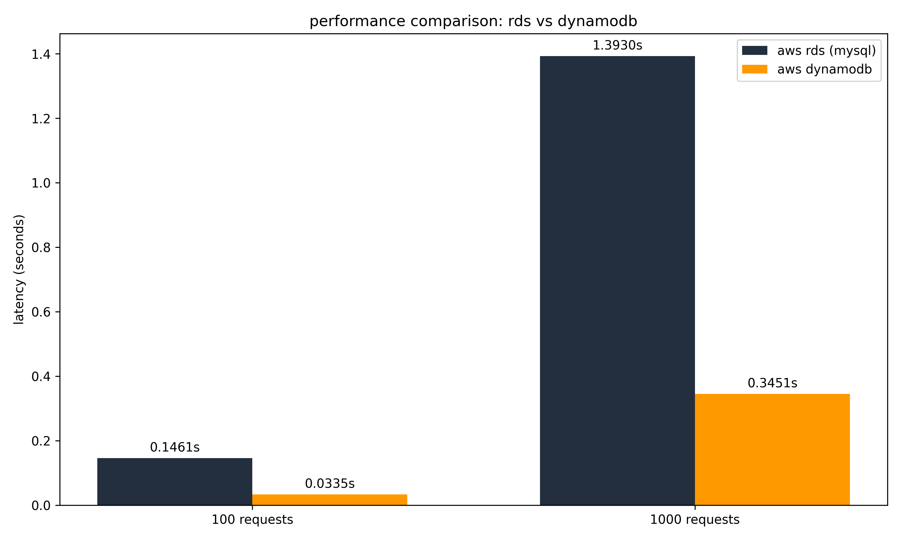

# RDS vs. DynamoDB Practicum


A cost and performance comparison of **instance-based (Amazon RDS/MySQL)** vs.
**serverless (Amazon DynamoDB)** databases for storing historical university
enrollment data, a workload that is written once and read rarely.

Using ten years of real Andrews University enrollment figures (2015-2025), this
practicum measures which model is faster and cheaper when records are queried
only a handful of times per month.

## The Question

Organizations keep records for a decade or more for auditing and compliance, yet
those records are seldom read. Paying for a database instance that runs 24/7 to
hold "cold" data is like renting a car by the day and leaving it in the garage.
A serverless model behaves more like a taxi: you pay only when a query actually
runs, and $0 when it sits idle.

This project tests that intuition with a real dataset and a real benchmark.

## Data

Source: **Andrews University Fact Book** (Office of Institutional Effectiveness),
headcount by major and department, academic years 2015-2025. The figures are
public, aggregate institutional statistics, no personal or student-level data.

- `data/au-enrollment-2015-2025.xlsx` raw multi-sheet export
- `data/au-enrollment-merged.xlsx` flattened and joined table used for loading

## Architecture

| | Amazon RDS (MySQL) | Amazon DynamoDB |
|---|---|---|
| Model | Instance-based, relational | Serverless, NoSQL |
| Table | `enrollment_stats` (flat rows) | `au_enrollment_stats` (single table) |
| Key | indexed columns | PK `academic_year` + SK `major_name` |
| Access pattern | `SELECT ... WHERE year AND major` | `get_item(year, major)`, no joins |
| Billing | pay per hour, always on | pay per request |

## Results

Average read latency, same "one year, one major" lookup repeated N times against
live AWS (us-east-1):

| Requests | RDS (MySQL) | DynamoDB | DynamoDB advantage |
|---:|---:|---:|---:|
| 100 | 0.1461 s | 0.0335 s | ~4.4x faster |
| 1000 | 1.3930 s | 0.3451 s | ~4.0x faster |



**Finding.** For this cold, seldom-read workload DynamoDB wins on both axes:
point lookups on the composite key are consistently ~4x faster than the SQL
query, and the pay-per-request model costs effectively $0 while idle versus the
fixed hourly charge of an always-on RDS instance. Full cost reasoning is in
[`docs/cost-performance-analysis.md`](docs/cost-performance-analysis.md).

**Limitations (read before citing the numbers).**
- Results come from a single practicum run against a specific AWS environment,
  since torn down; they are not re-runnable without provisioning your own.
- Small dataset and one access pattern. DynamoDB's edge here reflects key-value
  point lookups on cold data, it does not generalize to complex analytical
  queries, joins, or sustained high-throughput workloads where a warm RDS
  instance amortizes its fixed cost.
- Latency was measured serially, no concurrency or connection pooling tuning.

## Repository Layout

```
.
├── data/          au fact book exports + result chart
├── scripts/       data prep and aws provisioning / loading
│   ├── merge_data.py         flatten and join the raw workbook
│   ├── setup_dynamodb.py     create the dynamodb table
│   ├── load_data.py          load both backends from the merged data
│   └── generate_chart.py     render the latency chart
├── tests/         validation.py (integrity) + performance_test.py (latency)
├── certs/         aws rds global ca bundle for tls
└── docs/          cost-performance analysis + walkthrough video
```

## Running It Yourself

The scripts target live AWS resources. To reproduce you need your own RDS MySQL
instance and DynamoDB table.

```bash
python -m venv .venv && source .venv/bin/activate
pip install -r requirements.txt

cp .env.example .env        # fill in your RDS + AWS values
python scripts/merge_data.py
python scripts/setup_dynamodb.py
python scripts/load_data.py
python tests/validation.py       # confirm row counts match
python tests/performance_test.py # measure latency
```

Configuration (credentials, endpoints) is read from the environment, never
hardcoded. See `.env.example`.

## Context

Academic database practicum, Andrews University. A short walkthrough is in
[`docs/demo.mp4`](docs/demo.mp4).

## License

[MIT](LICENSE)
