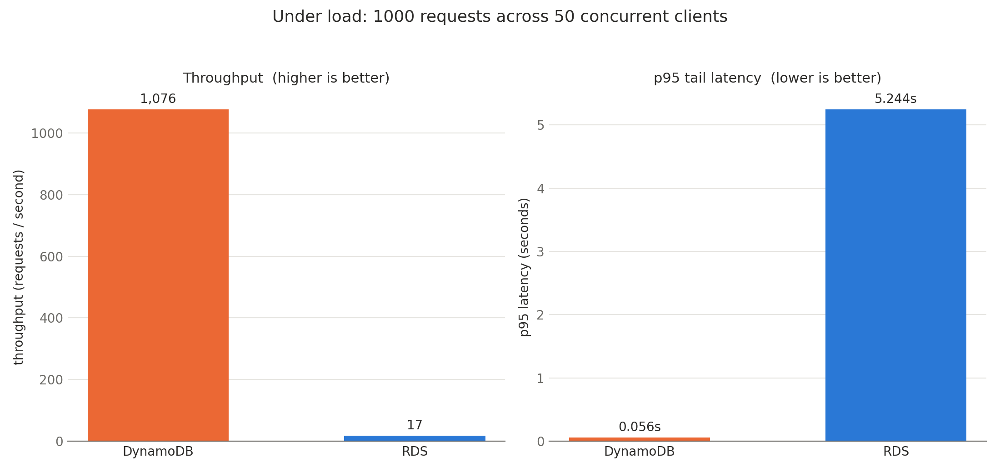

# RDS vs. DynamoDB Practicum


A cost and performance comparison of **instance-based (Amazon RDS/MySQL)** vs.
**serverless (Amazon DynamoDB)** databases for storing historical university
enrollment data, a workload that is written once and read rarely.

Using ten years of real Andrews University enrollment figures (2015-2025), this
practicum measures which model is faster and cheaper when records are queried
only a handful of times per month.

## The Question

Organizations keep records for a decade or more for auditing and compliance, yet
those records are seldom read. Paying for a database instance that runs 24/7 to
hold "cold" data is like renting a car by the day and leaving it in the garage.
A serverless model behaves more like a taxi: you pay only when a query actually
runs, and $0 when it sits idle.

This project tests that intuition with a real dataset and a real benchmark.

## Data

Source: **Andrews University Fact Book** (Office of Institutional Effectiveness),
headcount by major and department, academic years 2015-2025. The figures are
public, aggregate institutional statistics, no personal or student-level data.

- `data/au-enrollment-2015-2025.xlsx` raw multi-sheet export
- `data/au-enrollment-merged.xlsx` flattened and joined table used for loading

## Architecture

| | Amazon RDS (MySQL) | Amazon DynamoDB |
|---|---|---|
| Model | Instance-based, relational | Serverless, NoSQL |
| Table | `enrollment_stats` (flat rows) | `au_enrollment_stats` (single table) |
| Key | indexed columns | PK `academic_year` + SK `major_name` |
| Access pattern | `SELECT ... WHERE year AND major` | `get_item(year, major)`, no joins |
| Billing | pay per hour, always on | pay per request |

## Results

Average per-request read latency for the same "one year, one major" lookup,
sampled over N sequential requests against live AWS (us-east-1). The average is
stable across sample size, as an average should be; the gap between the two
backends is the result.

| Sample size | RDS (MySQL) | DynamoDB | DynamoDB advantage |
|---:|---:|---:|---:|
| 100 requests | 0.1438 s | 0.0345 s | ~4.2x faster |
| 1000 requests | 0.1454 s | 0.0318 s | ~4.6x faster |


**Finding.** For this cold, seldom-read workload DynamoDB wins on both axes:
point lookups on the composite key are consistently ~4x faster than the SQL
query, and the pay-per-request model costs effectively $0 while idle versus the
fixed hourly charge of an always-on RDS instance. Full cost reasoning is in
[`docs/cost-performance-analysis.md`](docs/cost-performance-analysis.md).

**Limitations (read before citing the numbers).**
- The numbers come from one benchmark run. The environment is provisioned from
  [`infra/`](infra/), but the exact latencies are not portable: they depend on
  the region, the instance class, and the network path from the client, so read
  them as directional rather than absolute.
- Small dataset and one access pattern. DynamoDB's edge here reflects key-value
  point lookups on cold data, it does not generalize to complex analytical
  queries, joins, or sustained high-throughput workloads where a warm RDS
  instance amortizes its fixed cost.
- Latency was measured serially, one request in flight at a time. That is a
  deliberately different experiment from the concurrent one below, not a
  weaker version of it.

## Concurrency Under Load

A serial benchmark answers "how fast is one lookup". It cannot reveal
connection-pool contention on RDS, and it never triggers DynamoDB throttling,
because only one request is ever outstanding.

`tests/concurrency_test.py` runs the same point lookup across a configurable
pool of threads and reports throughput plus p50/p95/p99 latency, because under
load the mean hides the requests a real user would notice. It sizes the
SQLAlchemy pool to the worker count, gives botocore a matching connection pool,
and disables boto3's automatic retries so throttling shows up in the numbers
instead of being silently absorbed.

```bash
python tests/concurrency_test.py --workers 50 --requests 1000
```

Result of 1,000 requests driven by 50 concurrent clients against live AWS
(us-east-1), DynamoDB in `PAY_PER_REQUEST` mode and RDS on a single
`db.t3.micro`:

| Backend | Throughput | p50 | p95 | p99 | Succeeded |
|---|---:|---:|---:|---:|---:|
| DynamoDB | 1,076 req/s | 0.034 s | 0.056 s | 0.295 s | 1000 / 1000 |
| RDS (`db.t3.micro`) | 17 req/s | 2.579 s | 5.244 s | 6.824 s | 897 / 1000 |



**Finding.** This is where the two models diverge sharply. DynamoDB absorbs the
concurrent load at ~1,076 req/s with a 56 ms p95 and zero failures. The single
RDS instance saturates: throughput collapses to ~17 req/s, p95 tail latency
crosses five seconds, and 103 of the 1,000 requests (10.3%) fail outright as the
instance hits its connection ceiling and resets connections. A bigger instance
or a read replica would raise that ceiling, at a cost; the serverless table
never had one to hit.

These numbers are **not** comparable to the serial table above, which measures a
single request in isolation. They are a different experiment and are reported
separately. The full result set, including mean and max, is in
`data/concurrency_results.json`.

## Infrastructure

Both backends are declared in [`infra/`](infra/) as Terraform. The RDS instance
and the DynamoDB table are created and destroyed together, so a benchmark run
starts from a known state and leaves nothing running.

Terraform is the single source of truth for the table's schema and billing
mode; there is no provisioning script to keep in sync with it.

```bash
cd infra
cp terraform.tfvars.example terraform.tfvars   # set allowed_cidr_blocks to your /32
export TF_VAR_db_password='...'                # never written to disk

terraform init
terraform plan      # creates nothing, costs nothing
terraform apply
terraform output env_file_snippet              # paste into ../.env

# ... run the benchmarks ...

terraform destroy
```

Two variables are worth knowing:

- `multi_az` (default `false`) replicates the RDS instance across availability
  zones and doubles its cost. DynamoDB replicates across AZs regardless.
- `dynamodb_billing_mode` (default `PAY_PER_REQUEST`) is the model this
  practicum argues for. Set it to `PROVISIONED` to watch a low read capacity
  throttle under concurrent load.

The security group has no default ingress range, and Terraform refuses an
`allowed_cidr_blocks` of `0.0.0.0/0`.

## Repository Layout

```
.
├── data/          au fact book exports + result charts + concurrency json
├── infra/         terraform: rds instance, dynamodb table, security group
├── scripts/       data prep and loading
│   ├── merge_data.py                 flatten and join the raw workbook
│   ├── load_data.py                  load both backends from the merged data
│   ├── generate_chart.py             render the serial latency chart
│   └── generate_concurrency_chart.py render the concurrency chart from json
├── tests/         validation.py (integrity), performance_test.py (serial
│                  latency), concurrency_test.py (load, tail latency)
├── certs/         aws rds global ca bundle for tls
└── docs/          cost-performance analysis + walkthrough video
```

## Running It Yourself

The scripts target live AWS resources. Provision them with Terraform first (see
[Infrastructure](#infrastructure)), then:

```bash
python -m venv .venv && source .venv/bin/activate
pip install -r requirements.txt

cp .env.example .env        # fill in from `terraform output env_file_snippet`
python scripts/merge_data.py
python scripts/load_data.py
python tests/validation.py        # confirm row counts match
python tests/performance_test.py  # serial latency
python tests/concurrency_test.py  # latency and throughput under load
```

Configuration (credentials, endpoints) is read from the environment, never
hardcoded. See `.env.example`.

## Context

Academic database practicum, Andrews University. A short walkthrough is in
[`docs/demo.mp4`](docs/demo.mp4).

## License

[MIT](LICENSE)
